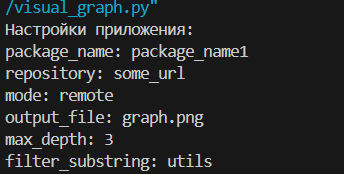

<h1> Вариант 16. Разработать инструмент визуализации графа зависимостей для менеджера 
пакетов. Готовые средства (менеджеры пакетов, библиотеки) для получения 
зависимостей использовать нельзя. </h1>

<h3> Этап 1. Минимальный прототип с конфигурацией. </h3>

**Общее описание.**

Цель: создать минимальное CLI-приложение и сделать его настраиваемым. 

Требования: 
1. Источником настраиваемых пользователем параметров является 
конфигурационный файл формата INI. 
2. К настраиваемым параметрам относятся: – Имя анализируемого пакета. – URL-адрес репозитория или путь к файлу тестового репозитория. – Режим работы с тестовым репозиторием. – Имя сгенерированного файла с изображением графа. – Максимальная глубина анализа зависимостей. – Подстрока для фильтрации пакетов. 
3. (только для этого этапа) При запуске приложения вывести все параметры, 
настраиваемые пользователем, в формате ключ-значение. 
4. Реализовать и продемонстрировать обработку ошибок для всех параметров. 
5. Результат выполнения этапа сохранить в репозиторий стандартно 
оформленным коммитом.

**Примеры использования.**

- Вывод всех заданных в файле config.ini параметров.